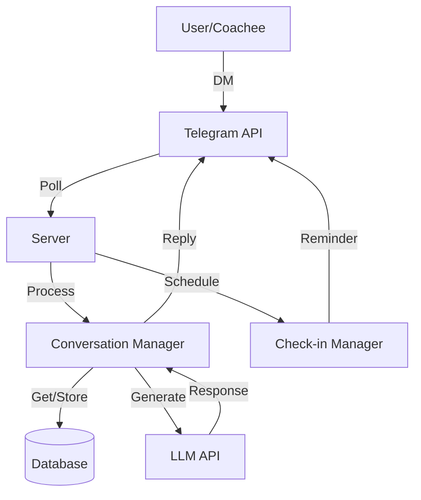

# Habita Health Coach

## Getting Started

```bash
cp .env.example .env

npm install
```

```bash
npm run docker:up
```

## Philosophy & Scope

### Core Philosophy

- Build healthier habits through consistent, small actions
- Focus on behavioral change and accountability
- Supportive and encouraging interactions
- Regular check-ins and progress tracking
- Iterative adjustment based on feedback

### Key Features

- Initial lifestyle assessment (LLM-assisted)
- Personalized goal setting (LLM-assisted)
- Action planning and tracking (LLM-assisted)
- Regular check-ins via Telegram messages (workflow)
- Progress monitoring and adjustments (LLM-assisted)

### Focus Areas

- Sleep and circadian rhythms
- Mood and stress management
- Diet and nutrition
- Movement and exercise

## Technical Architecture

### Core Components

1. Backend Server

   - Node.js with TypeScript
   - Background services for polling and scheduling

2. Database

   - PostgreSQL

3. External SDKs
   - Telegram Bot SDK
   - LLM SDK (e.g., Groq)

### Key Libraries

- `telegraf`: telegraf Bot SDK
- `groq-sdk`: Groq SDK
- `prisma`: Database ORM
- `node-cron`: Task scheduling

## Entities & States

### Core Entities

1. Coach (Habita)

   - Bot identity
   - Coaching personality
   - Command handlers
   - Response patterns

2. Coachee

   - Telegram identity (userId, chatId)
   - Current goals
   - Progress metrics

3. Goals

   - Category
   - Specific targets
   - Timeline
   - Status and priority

4. Actions

   - Specific tasks
   - Frequency
   - Location if relevant (eg. HIIT workout at local gym)
   - Completion status

5. Check-ins
   - Scheduled time
   - Response tracking
   - Progress updates

## Core Modules

### Message Handler

- Polls Telegram
- Processes incoming messages
- Manages response queue
- Handles threading

### Conversation Manager

- Maintains conversation state
- Processes user inputs
- Manages context
- Coordinates responses

### Coaching Logic

- Analyzes user inputs
- Generates recommendations
- Tracks progress
- Adjusts plans

```typescript
class CoachingService {
  async suggestActions(goal: Goal): Promise<Action[]> {
    // Use LLM to generate appropriate actions
    const prompt = this.buildActionPrompt(goal);
    const response = await this.llm.complete(prompt);
    return this.parseActions(response);
  }

  async evaluateProgress(userId: string): Promise<ProgressReport> {
    const goals = await this.db.getActiveGoals(userId);
    return goals.map((goal) => this.calculateProgress(goal));
  }
}
```

### Check-in Manager

- Schedules check-ins
- Generates reminders
- Processes responses
- Updates progress

## Flow Diagrams

### System Flow



## Techical Specifications

See the [TECH-SPEC](https://github.com/TheodoreChuang/habita/blob/main/TECH-SPEC.md) document for implementation details.
