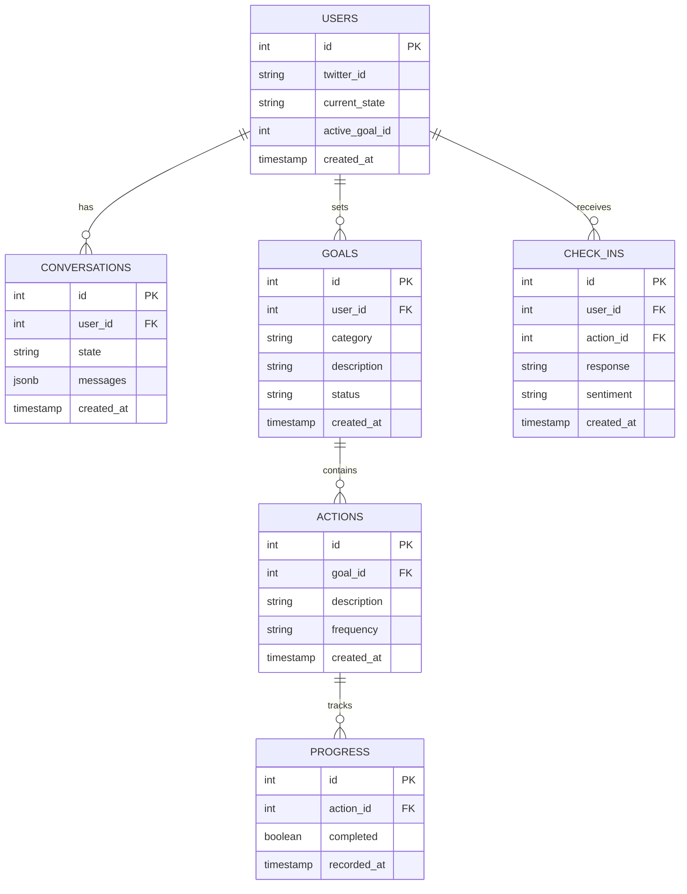
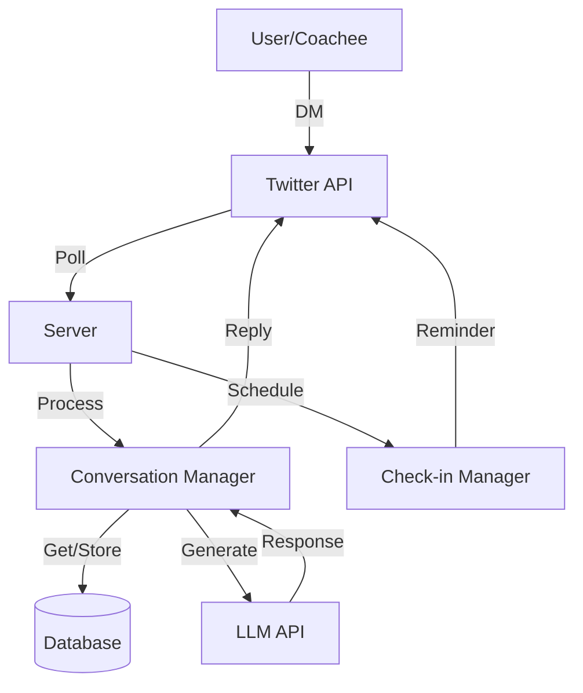
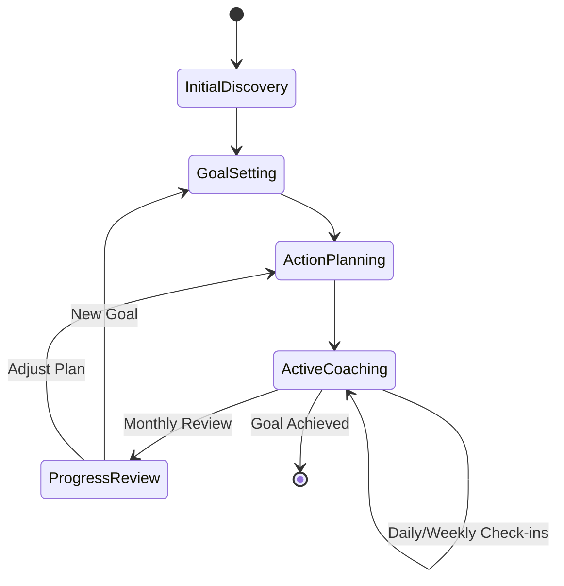

# Habita Health Coach - Technical Specification

## Philosophy & Scope

### Core Philosophy

- Build healthier habits through consistent, small actions
- Focus on behavioral change and accountability
- Supportive and encouraging interaction style
- Regular check-ins and progress tracking
- Iterative adjustment based on feedback

### Key Features

- Initial lifestyle assessment
- Personalized goal setting
- Action planning and tracking
- Regular check-ins via Telegram messages
- Progress monitoring and adjustments

### Focus Areas

- Sleep and circadian rhythms
- Mood and stress management
- Diet and nutrition
- Movement and exercise

## Technical Architecture

### Core Components

1. Backend Server

   - Node.js with TypeScript
   - Background services for polling and scheduling
   - Single process architecture

2. Database

   - PostgreSQL

3. External APIs
   - Telegram Bot API
   - LLM API (e.g., Groq) for response generation

### Key Libraries

- `twitter-api-v2`: Twitter API client
- `prisma`: Database ORM
- `node-cron`: Task scheduling
- `zod`: Type validation
- `dotenv`: Environment configuration

#### Implementation Guidelines

```typescript
// Telegram Bot setup
import { Telegraf } from "telegraf";
const bot = new Telegraf(process.env.TELEGRAM_BOT_TOKEN);

// Prisma setup
import { PrismaClient } from "@prisma/client";
const prisma = new PrismaClient();

// Type validation
import { z } from "zod";
const MessageSchema = z.object({
  id: z.string(),
  chatId: z.number(),
  text: z.string(),
  userId: z.number(),
  userName: z.string().optional(),
  command: z.string().optional(),
  timestamp: z.date(),
});
```

## Entities & States

### Core Entities

1. Coach (Habita)
    - Bot identity
    - Coaching personality
    - Command handlers
    - Response patterns

2. Coachee

    - Telegram identity (userId, chatId)
    - Current goals
    - Progress metrics

3. Goals

   - Category
   - Specific targets
   - Timeline
   - Status and priority

4. Actions

   - Specific tasks
   - Frequency
   - Completion status

5. Check-ins
   - Scheduled time
   - Response tracking
   - Progress updates

### Conversation States

1. Initial Discovery

   - Personal background
   - Current lifestyle
   - Health priorities

2. Goal Setting

   - Category selection
   - Specific goal definition
   - Timeline establishment

3. Action Planning

   - Task definition
   - Frequency setting
   - Success criteria

4. Active Coaching

   - Regular check-ins
   - Progress tracking
   - Adjustments

5. Progress Review
   - Achievement assessment
   - Pattern recognition
   - Plan adjustment

#### Conversation States

```typescript
type ConversationState =
  | "initial_discovery"
  | "goal_setting"
  | "action_planning"
  | "active_coaching"
  | "progress_review";

interface Command {
  name: string;
  handler: (msg: Message) => Promise<void>;
  description: string;
}

const commands: Record<string, Command> = {
  start: {
    name: 'start',
    description: 'Begin your health journey',
    handler: async (msg) => {/* ... */}
  },
  goal: {
    name: 'goal',
    description: 'Set a new health goal',
    handler: async (msg) => {/* ... */}
  },
  status: {
    name: 'status',
    description: 'Check your progress',
    handler: async (msg) => {/* ... */}
  },
  help: {
    name: 'help',
    description: 'Show available commands',
    handler: async (msg) => {/* ... */}
  }
};NextActions(): Promise<Action[]>;
```

## Core Modules

### Message Handler

- Polls Telegram
- Processes incoming messages
- Manages response queue
- Handles threading

```typescript
class TelegramService {
  private bot: Telegraf;
  private lastUpdateId: number = 0;

  constructor(config: TelegramConfig) {
    this.bot = new Telegraf(config.botToken);
  }

  async pollUpdates(): Promise<Message[]> {
    try {
      const updates = await this.bot.telegram.getUpdates({
        offset: this.lastUpdateId + 1,
        limit: 100,
        timeout: 0
      });

      if (updates.length > 0) {
        this.lastUpdateId = updates[updates.length - 1].update_id;
        return this.convertUpdatesToMessages(updates);
      }

      return [];
    } catch (error) {
      console.error('Polling error:', error);
      return [];
    }
  }

  async sendMessage(chatId: number, text: string): Promise<boolean> {
    try {
      await this.bot.telegram.sendMessage(chatId, text);
      return true;
    } catch (error) {
      console.error('Send error:', error);
      return false;
    }
  }
}
```

### Conversation Manager

- Maintains conversation state
- Processes user inputs
- Manages context
- Coordinates responses

```typescript
class ConversationManager {
  constructor(
    private stateHandlers: Record<ConversationState, StateHandler>,
    private db: DatabaseService
  ) {}

  async handleMessage(message: Message): Promise<void> {
    if (message.command) {
      await this.handleCommand(message);
      return;
    }

    const conversation = await this.db.getConversation(message.userId);
    const handler = this.stateHandlers[conversation.state];
    const response = await handler.process(message);
    await this.telegram.sendMessage(message.chatId, response);
  }
}
```

### Coaching Logic

- Analyzes user inputs
- Generates recommendations
- Tracks progress
- Adjusts plans

```typescript
class CoachingService {
  async suggestActions(goal: Goal): Promise<Action[]> {
    // Use LLM to generate appropriate actions
    const prompt = this.buildActionPrompt(goal);
    const response = await this.llm.complete(prompt);
    return this.parseActions(response);
  }

  async evaluateProgress(userId: string): Promise<ProgressReport> {
    const goals = await this.db.getActiveGoals(userId);
    return goals.map((goal) => this.calculateProgress(goal));
  }
}
```

### Check-in Manager

- Schedules check-ins
- Generates reminders
- Processes responses
- Updates progress

## Database Schema

### Database ERD



```sql
CREATE TABLE users (
    id SERIAL PRIMARY KEY,
    telegram_id BIGINT UNIQUE,
    chat_id BIGINT,
    username TEXT,
    current_state TEXT,
    created_at TIMESTAMP DEFAULT NOW()
);

CREATE TABLE conversations (
    id SERIAL PRIMARY KEY,
    user_id INTEGER REFERENCES users,
    state TEXT,
    messages JSONB[],
    created_at TIMESTAMP DEFAULT NOW()
);

CREATE TABLE goals (
    id SERIAL PRIMARY KEY,
    user_id INTEGER REFERENCES users,
    category TEXT,
    description TEXT,
    status TEXT,
    priority INTEGER,
    created_at TIMESTAMP DEFAULT NOW()
);

CREATE TABLE actions (
    id SERIAL PRIMARY KEY,
    goal_id INTEGER REFERENCES goals,
    description TEXT,
    frequency TEXT,
    created_at TIMESTAMP DEFAULT NOW()
);

CREATE TABLE progress (
    id SERIAL PRIMARY KEY,
    action_id INTEGER REFERENCES actions,
    completed BOOLEAN,
    recorded_at TIMESTAMP DEFAULT NOW()
);

CREATE TABLE check_ins (
    id SERIAL PRIMARY KEY,
    user_id INTEGER REFERENCES users,
    action_id INTEGER REFERENCES actions,
    response TEXT,
    sentiment TEXT,
    created_at TIMESTAMP DEFAULT NOW()
);

-- Indexes
CREATE INDEX idx_users_telegram_id ON users(telegram_id);
CREATE INDEX idx_goals_user_status ON goals(user_id, status);
CREATE INDEX idx_progress_action_date ON progress(action_id, recorded_at);
```

## Flow Diagrams

### System Flow



### Conversation Flow



## Implementation Guidelines

### Project Structure

```
src/
├── index.ts                 # Application entry point
├── config/
│   └── env.ts              # Environment configuration
├── services/
│   ├── telegram.ts         # Telegram Bot integration
│   ├── llm.ts             # LLM API integration
│   ├── conversation.ts     # Conversation management
│   └── coaching.ts         # Coaching logic
├── commands/               # Command handlers
├── models/                 # Type definitions
├── handlers/              # State handlers
└── utils/                 # Helper functions
```

### Error Handling

```typescript
// Global error handler
process.on("unhandledRejection", (error: Error) => {
  console.error("Unhandled rejection:", error);
  // Implement error reporting
});

// Service-level error handling
class BaseService {
  protected async handleError(error: Error): Promise<void> {
    if (error instanceof TwitterApiError) {
      // Handle rate limits, retry
    } else if (error instanceof DatabaseError) {
      // Handle connection issues
    }
    // Log error
    throw error;
  }
}
```
