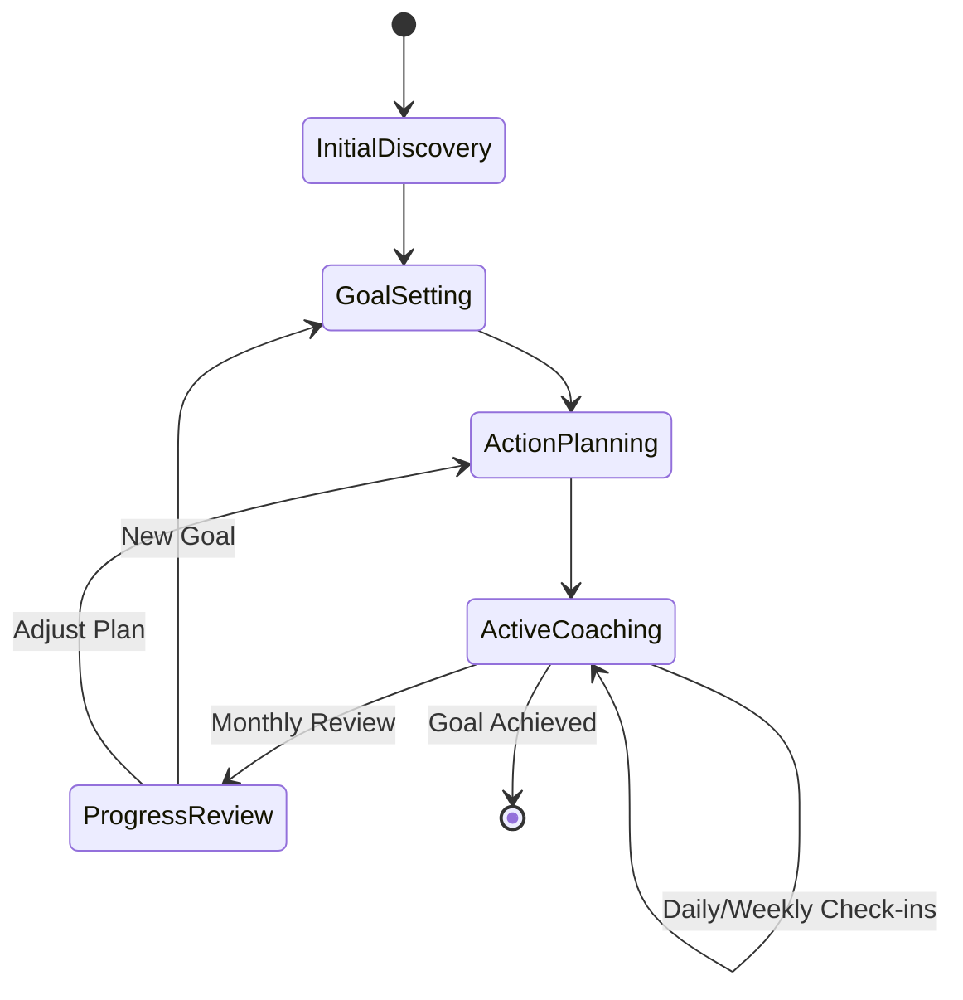
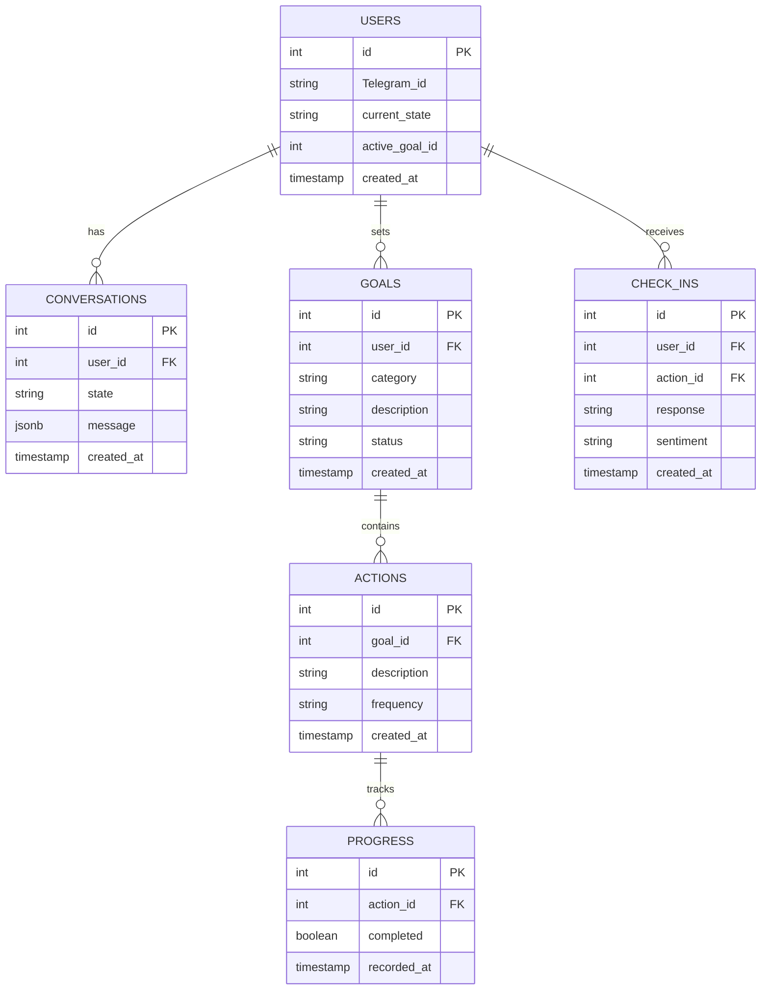

# Technical Specifications

## [TODO] Error Handling

```typescript
// Global error handler
process.on("unhandledRejection", (error: Error) => {
  console.error("Unhandled rejection:", error);
  // Implement error reporting
});

// Service-level error handling
class BaseService {
  protected async handleError(error: Error): Promise<void> {
    if (error instanceof TelegramApiError) {
      // Handle rate limits, retry
    } else if (error instanceof DatabaseError) {
      // Handle connection issues
    }
    // Log error
    throw error;
  }
}
```

## Archived

<details>
    <summary><h2 style="display:inline-block">Conversation State Machine</h2></summary>

States were used in a state machine pattern but were too rigid. Instead of explicitly tracking an user's "state", the LLM has been instructed to coach users while considering something similar.

1. Initial Discovery

- Personal background
- Current lifestyle
- Health priorities

2. Goal Setting

- Category selection
- Specific goal definition
- Timeline establishment

3. Action Planning

- Task definition
- Frequency setting
- Success criteria
- Guided by Habita

4. Active Coaching

- Regular check-ins
- Progress tracking
- Adjustments

5. Progress Review

- Achievement assessment
- Plan adjustment

### Conversation Flow



</details>

<details>
    <summary><h2 style="display:inline-block">Initial ERD</h2></summary>

This was the initial ERD designed before implementation. Since implemenatation shifted to relying on the LLM these become less relevant but as we add more sophisticated we made need to revisit these entities.



</details>
