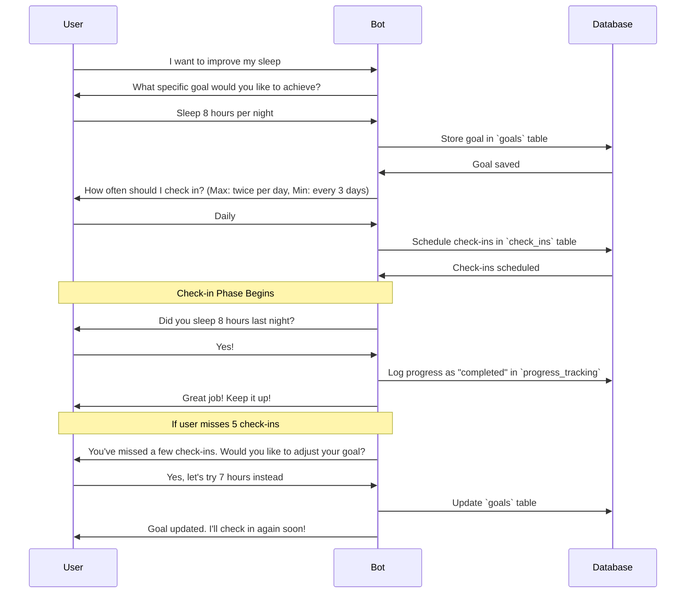
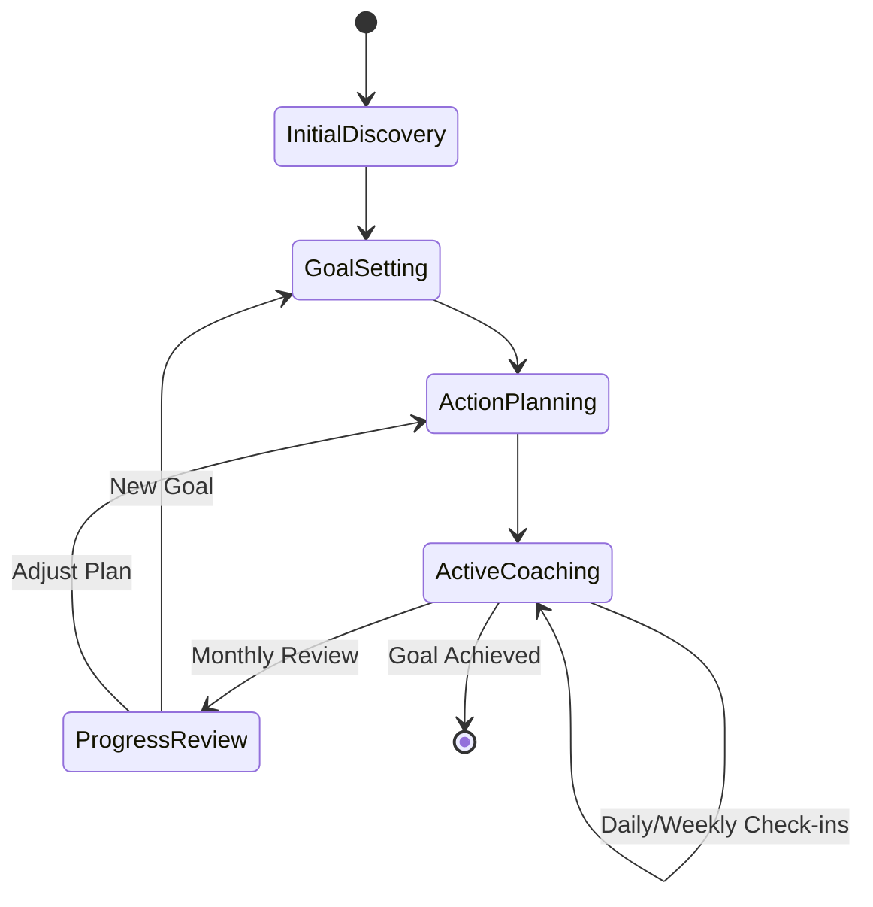
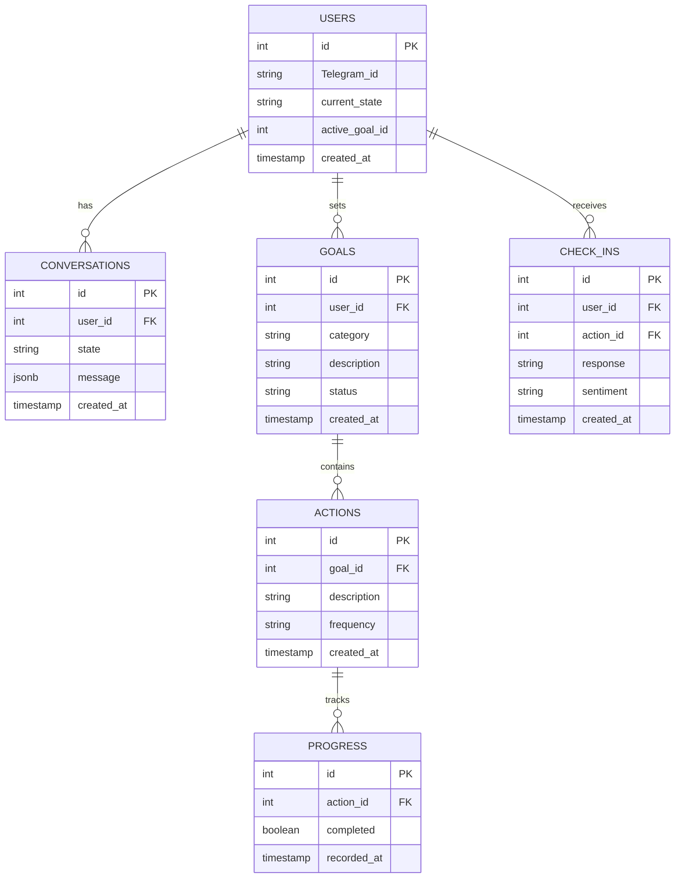

# Technical Specifications

## Implemented

<details>
  <summary><h3 style="display:inline-block">Hackathon POC</h3></summary>

### Core Modules

#### Message Handler

- Polls Telegram
- Processes incoming messages
- Manages response queue
- Handles threading

#### Conversation Manager

- Maintains conversation state
- Processes user inputs
- Manages context
- Dynamic responses generation by LLM

#### Integrations

- Telegram
- Groq

</details>

## Up Next

<details>
  <summary><h3 style="display:inline-block">Conversation Summarization & Memory Optimization</h3></summary>

### Goal

- Prevent performance issues by **limiting message history** while keeping key insights.
- Store **summaries of past conversations** to retain long-term context.
- Ensure **tracked commitments** (e.g., "User plans to meditate daily") remain accessible.

### Summary Trigger Rules

Summarization occurs when either condition is met:

1. **50 messages exchanged** since the last summary.
2. **21 days have passed** since the last summary.

Reasoning:

- Users with **high message volume** get summarized frequently.
- Users with **low engagement** still receive periodic summaries to prevent context loss.
- This approach is **simple, conservative, and easy to adjust later**.

### Summary Storage & Retrieval

- Summaries are stored in a separate `summaries` table.
- When sending context to the LLM, retrieve:
  - The **latest `N` messages** (raw history).
  - The **most recent summary**, but **exclude the latest `N` messages from it** to prevent redundancy.

### Database Schema

#### Messages Table

Currently the `Conversation` table but we may want to refactor this.

| Column      | Type            | Description                        |
| ----------- | --------------- | ---------------------------------- |
| `id`        | UUID (PK)       | Unique identifier for each message |
| `user_id`   | UUID (FK)       | References `users` table           |
| `text`      | TEXT            | Message content                    |
| `role`      | ENUM(user, bot) | Who sent the message               |
| `timestamp` | TIMESTAMP       | When the message was sent          |

#### Summaries Table

| Column          | Type      | Description                                |
| --------------- | --------- | ------------------------------------------ |
| `id`            | UUID (PK) | Unique identifier for the summary          |
| `user_id`       | UUID (FK) | References `users` table                   |
| `summary`       | TEXT      | AI-generated summary of past messages      |
| `tracked_goals` | JSONB     | Structured data on user’s goals & progress |
| `created_at`    | TIMESTAMP | When the summary was generated             |

</details>

<details>
  <summary><h3 style="display:inline-block">Proactive Coaching & Check-ins</h3></summary>

### Goal

- Ensure users **stay accountable** with **habit-specific check-ins**.
- Allow the **AI to track repeated actions** and adjust coaching based on progress.
- Provide **flexibility** for users to manage check-in frequency and opt out if needed.

### Check-in Frequency Rules

- **Users specify check-in frequency**, guided by the coach.
- **Frequency must be within:**
  - **Max:** **2 times per day** (prevents spam).
  - **Min:** **Every 3 days** (ensures habits stay relevant).

**Example Habit-Based Check-in Frequencies:**  
| Habit Type | Suggested Frequency |
|------------|------------------|
| **Daily habits** (e.g., “Eat 20g of protein at breakfast”) | **Daily** |
| **Frequent habits** (e.g., “Drink water every hour while awake”) | **Multiple times per day** (up to 2 max) |
| **Scheduled habits** (e.g., “Exercise 3 times a week”) | **Every 2-3 days** |

**Edge Case Handling:**

- If a habit **doesn’t fit neatly**, default to **daily or every 3 days**.
- The coach should guide users in **selecting an appropriate frequency**.

### Handling Missed Check-ins

If a user **doesn’t respond**, the coach will **continue at the same frequency**.  
If a user **proactively provides an update**, the next scheduled check-in **may be canceled**.  
If a user **misses 5 consecutive check-ins**, the AI will **suggest adjusting the goal** to be more achievable.

### Tracking Progress & Repeated Actions

**Structured progress tracking** will store each completed/missed action:

```json
{
  "goal": "Drink water every hour",
  "check_in_frequency": "daily",
  "history": [
    { "date": "2025-02-10", "status": "completed" },
    { "date": "2025-02-11", "status": "missed" }
  ]
}
```

This enables future features like:

- Visualizing progress (graphs, streaks, trends)
- Gamification (streak rewards, badges)
- Adaptive coaching (suggesting easier actions if struggles continue)

### Stopping & Resuming Check-ins

- Users can stop all check-ins with a command (e.g., /stop_checkins).
- Users can resume coaching by:
  - Explicitly restarting check-ins (e.g., /start_checkins).
  - Setting a new goal, which will automatically trigger check-ins.
    - No confirmation is required, but the bot should:
      - Confirm that reminders have been stopped.
      - Provide instructions on how to resume check-ins.

### Database Schema

#### Goals Table

| Column        | Type                               | Description                                     |
| ------------- | ---------------------------------- | ----------------------------------------------- |
| `id`          | UUID (PK)                          | Unique identifier for goal                      |
| `user_id`     | UUID (FK)                          | References `users` table                        |
| `description` | TEXT                               | Goal description (e.g., “Drink 2L water daily”) |
| `created_at`  | TIMESTAMP                          | When the goal was created                       |
| `status`      | ENUM(active, completed, abandoned) | Current goal status                             |

#### Check-ins Table

| Column          | Type                                    | Description                         |
| --------------- | --------------------------------------- | ----------------------------------- |
| `id`            | UUID (PK)                               | Unique identifier for check-in      |
| `user_id`       | UUID (FK)                               | References `users` table            |
| `goal_id`       | UUID (FK)                               | References `goals` table            |
| `next_check_in` | TIMESTAMP                               | When the next check-in will be sent |
| `frequency`     | ENUM(daily, every_2_days, every_3_days) | How often to check in               |

#### Progress Tracking Table

| Column    | Type                    | Description                          |
| --------- | ----------------------- | ------------------------------------ |
| `id`      | UUID (PK)               | Unique identifier for progress entry |
| `user_id` | UUID (FK)               | References `users` table             |
| `goal_id` | UUID (FK)               | References `goals` table             |
| `date`    | TIMESTAMP               | When the progress was recorded       |
| `status`  | ENUM(completed, missed) | Whether the action was completed     |

### Server Implementation: CRON Job for Scheduled Check-ins

- The server will run a CRON job every hour to check for due check-ins and send reminders.

CRON Job Logic

1. Query check_ins table for next_check_in timestamps that are past due.
2. Send a check-in message to the user.
3. If the user responds, log it in progress_tracking and schedule the next check-in.
4. If no response after 5 check-ins, suggest adjusting the goal.
5. Update next_check_in based on frequency.

Why CRON?

- Simple to implement.
- Runs independently of the main app.

### End-to-End Flow Example



</details>

<details>
  <summary><h3 style="display:inline-block">Error Handling</h3></summary>

```typescript
// Global error handler
process.on("unhandledRejection", (error: Error) => {
  console.error("Unhandled rejection:", error);
  // Implement error reporting
});

// Service-level error handling
class BaseService {
  protected async handleError(error: Error): Promise<void> {
    if (error instanceof TelegramApiError) {
      // Handle rate limits, retry
    } else if (error instanceof DatabaseError) {
      // Handle connection issues
    }
    // Log error
    throw error;
  }
}
```

</details>

## Archived

<details>
  <summary><h3 style="display:inline-block">Conversation State Machine</h3></summary>

States were used in a state machine pattern but were too rigid. Instead of explicitly tracking an user's "state", the LLM has been instructed to coach users while considering something similar.

1. Initial Discovery

- Personal background
- Current lifestyle
- Health priorities

2. Goal Setting

- Category selection
- Specific goal definition
- Timeline establishment

3. Action Planning

- Task definition
- Frequency setting
- Success criteria
- Guided by Habita

4. Active Coaching

- Regular check-ins
- Progress tracking
- Adjustments

5. Progress Review

- Achievement assessment
- Plan adjustment

### Conversation Flow



### Core Entities

1. Coach (Habita)

   - Bot identity
   - Coaching personality
   - Command handlers
   - Response patterns

2. Coachee

   - Telegram identity (userId, chatId)
   - Current goals
   - Progress metrics

3. Goals

   - Category
   - Specific targets
   - Timeline
   - Status and priority

4. Actions

   - Specific tasks
   - Frequency
   - Location if relevant (eg. HIIT workout at local gym)
   - Completion status

5. Check-ins
   - Scheduled time
   - Response tracking
   - Progress updates

</details>

<details>
    <summary><h3 style="display:inline-block">Initial ERD</h3></summary>

This was the initial ERD designed before implementation. Since implemenatation shifted to relying on the LLM these become less relevant but as we add more sophisticated we made need to revisit these entities.



</details>
