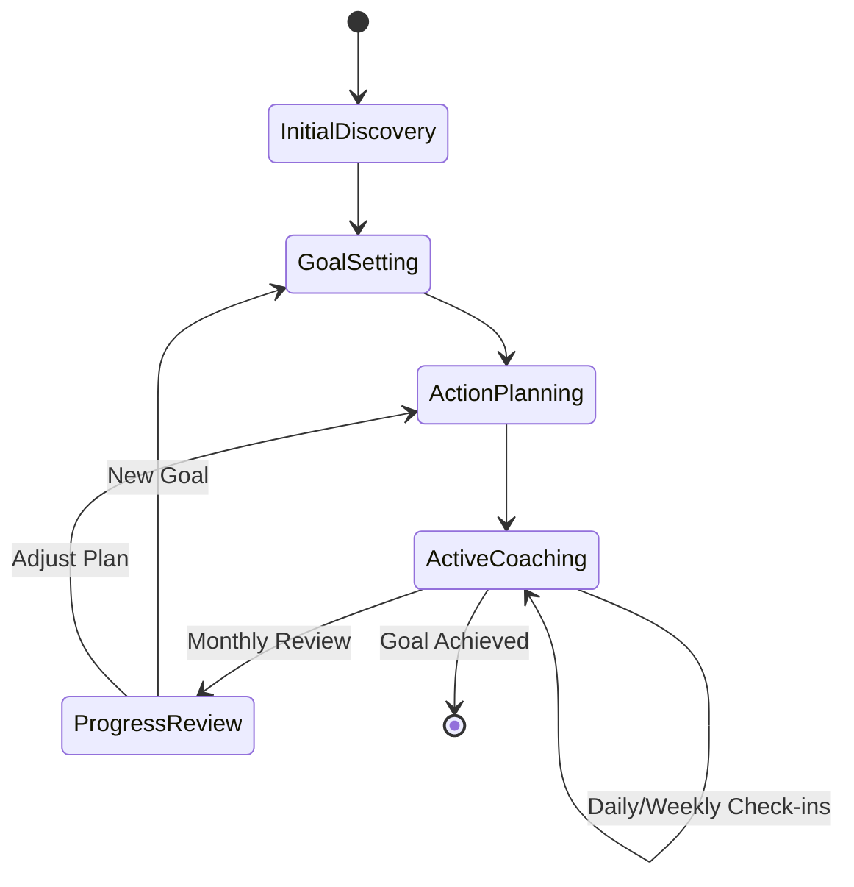
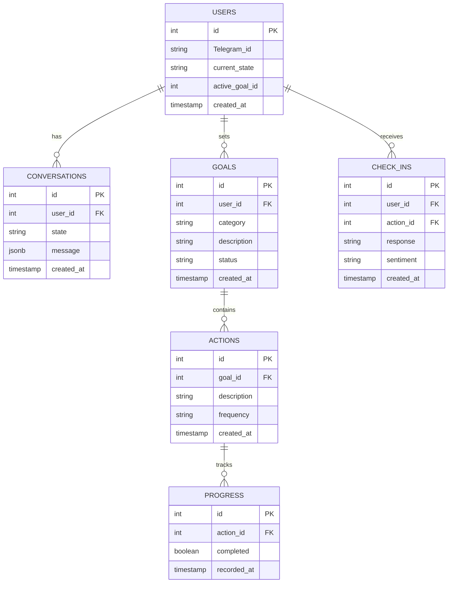

# Technical Specifications

<details>
    <summary><h3 style="display:inline-block">Conversation Summarization & Memory Optimization</h3></summary>

### Goal

- Prevent performance issues by **limiting message history** while keeping key insights.
- Store **summaries of past conversations** to retain long-term context.
- Ensure **tracked commitments** (e.g., "User plans to meditate daily") remain accessible.

### Summary Trigger Rules

Summarization occurs when either condition is met:

1. **50 messages exchanged** since the last summary.
2. **21 days have passed** since the last summary.

Reasoning:

- Users with **high message volume** get summarized frequently.
- Users with **low engagement** still receive periodic summaries to prevent context loss.
- This approach is **simple, conservative, and easy to adjust later**.

### Summary Storage & Retrieval

- Summaries are stored in a separate `summaries` table.
- When sending context to the LLM, retrieve:
  - The **latest `N` messages** (raw history).
  - The **most recent summary**, but **exclude the latest `N` messages from it** to prevent redundancy.

### Database Schema

#### Messages Table

Currently the `Conversation` table but we may want to refactor this.

| Column      | Type            | Description                        |
| ----------- | --------------- | ---------------------------------- |
| `id`        | UUID (PK)       | Unique identifier for each message |
| `user_id`   | UUID (FK)       | References `users` table           |
| `text`      | TEXT            | Message content                    |
| `role`      | ENUM(user, bot) | Who sent the message               |
| `timestamp` | TIMESTAMP       | When the message was sent          |

#### Summaries Table

| Column          | Type      | Description                                |
| --------------- | --------- | ------------------------------------------ |
| `id`            | UUID (PK) | Unique identifier for the summary          |
| `user_id`       | UUID (FK) | References `users` table                   |
| `summary`       | TEXT      | AI-generated summary of past messages      |
| `tracked_goals` | JSONB     | Structured data on user’s goals & progress |
| `created_at`    | TIMESTAMP | When the summary was generated             |

</details>

<details>
    <summary><h3 style="display:inline-block">Error Handling</h3></summary>

```typescript
// Global error handler
process.on("unhandledRejection", (error: Error) => {
  console.error("Unhandled rejection:", error);
  // Implement error reporting
});

// Service-level error handling
class BaseService {
  protected async handleError(error: Error): Promise<void> {
    if (error instanceof TelegramApiError) {
      // Handle rate limits, retry
    } else if (error instanceof DatabaseError) {
      // Handle connection issues
    }
    // Log error
    throw error;
  }
}
```

</details>

## Archived

<details>
    <summary><h3 style="display:inline-block">Conversation State Machine</h3></summary>

States were used in a state machine pattern but were too rigid. Instead of explicitly tracking an user's "state", the LLM has been instructed to coach users while considering something similar.

1. Initial Discovery

- Personal background
- Current lifestyle
- Health priorities

2. Goal Setting

- Category selection
- Specific goal definition
- Timeline establishment

3. Action Planning

- Task definition
- Frequency setting
- Success criteria
- Guided by Habita

4. Active Coaching

- Regular check-ins
- Progress tracking
- Adjustments

5. Progress Review

- Achievement assessment
- Plan adjustment

### Conversation Flow



</details>

<details>
    <summary><h3 style="display:inline-block">Initial ERD</h3></summary>

This was the initial ERD designed before implementation. Since implemenatation shifted to relying on the LLM these become less relevant but as we add more sophisticated we made need to revisit these entities.



</details>
